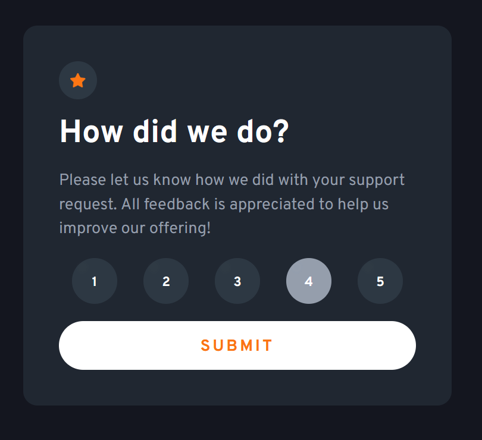
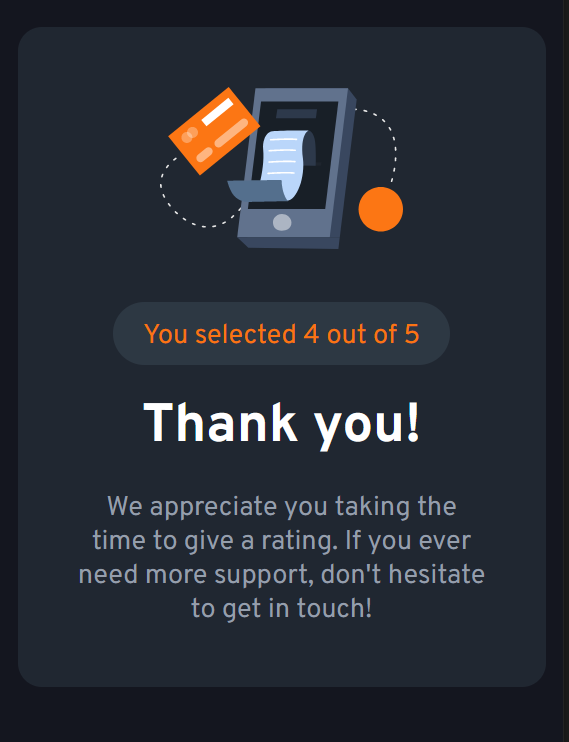

# Frontend Mentor - Interactive rating component solution

This is a solution to the [Interactive rating component challenge on Frontend Mentor](https://www.frontendmentor.io/challenges/interactive-rating-component-koxpeBUmI). The rating component enables users to provide a rating from 1 to 5 by selecting the desired number, and it provides an immediate response upon clicking.

## Table of contents

- [Overview](#overview)
  - [The challenge](#the-challenge)
  - [Screenshot](#screenshots-of-my-final-project)
  - [Link](#link)
- [My process](#my-process)
  - [Built with](#built-with)
  - [What I learnt](#what-i-learnt)
  - [Continued development](#continued-development)
  - [Useful resources](#useful-resources)

## Overview

### The challenge

In this challenge, the goal was to create an interactive rating component that allows users to view the interface in an optimal layout based on their device's screen size. The challenge also required implementing hover and focus states for all interactive elements on the page.

### Screenshots of my final project

<span>


</span>

### Link

- Live Site URL: [project hosted on Netlify](https://mellow-sprinkles-476ed8.netlify.app)

## My process

In my solution, I employed a mobile-first approach, starting with the design for mobile devices and then progressively enhancing it for larger screens. I created utility classes for fonts, colors, and sizes, and then proceeded to implement the buttons and overall layout.

### Built with

- Semantic HTML5 markup
- CSS custom properties
- Flexbox
- Mobile-first workflow
- JavaScript (DOM manipulation)

### What I learnt

Throughout this challenge, I gained experience in using JavaScript for DOM manipulation and further honed my skills in responsive design. I also deepened my understanding of CSS customizations, particularly in relation to creating interactive elements like radio buttons.

```css
.submit-button:hover {
  color: hsl(var(--clr-orange));
  background-color: hsl(var(--clr-white));
  cursor: pointer;
}
```

```js
buttonList.forEach((item) => {
  item.classList.remove("active");
});
```

### Continued development

In future projects, I plan to explore and implement best practices for communication between JavaScript and HTML.

### Useful resources

- [Create a Design System with CSS](https://www.youtube.com/watch?v=lRaL-8qZ0mM) - This video tutorial provided valuable insights into working with more complex CSS tools. The design system pattern presented in the video was particularly useful and I intend to incorporate it in my future projects.
- [Pure CSS Custom Styled Radio Buttons](https://moderncss.dev/pure-css-custom-styled-radio-buttons/) - This article presents an excellent solution for creating custom-styled radio buttons using pure CSS. It clarified the concept for me, and I highly recommend it to anyone looking to enhance their understanding of radio buttons.
